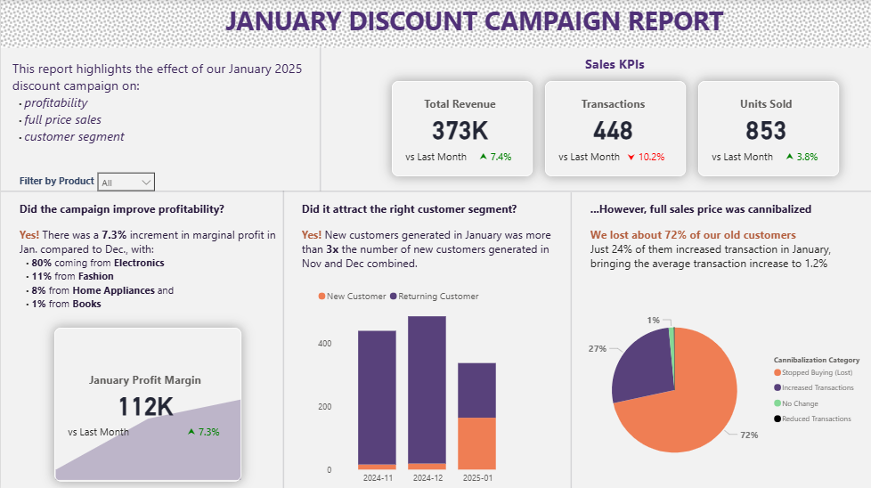

# Descriptive Analysis of the Impact of a Discount Campaign on Profitability

## Executive Summary
Leveraging Excel, SQL, Python, and Power BI, I designed an automated data pipeline and reporting workflow to assess the impact of a discount campaign on company profitability. The project involved cleaning raw datasets in Excel, migrating them to a MySQL database, and automating updates using Python scripts. The database was then integrated with Power BI for dynamic visualization and analysis.

Key insights from the analysis revealed that:

 - Overall profitability improved in January.
 - Full-price sales experienced partial cannibalization.
 - The campaign successfully attracted new customers.

## Business Problem:
In January, a retail company launched a 15% discount campaign that led to a noticeable increase in sales volume. However, the CEO was uncertain about its true financial impact and sought deeper insights. Specifically, the company wanted to determine:

- Did the campaign actually improve overall profitability?
- To what extent did it cannibalize full-price sales?
- Did it attract the intended customer segments (new customers)?

## Methodology

To systematically evaluate the campaign’s impact on profitability and customer behavior, I structured the project into four key phases:

#### 1. Data Cleaning & Exploratory Data Analysis (EDA)

* Processed and refined customer transaction and product datasets using **Microsoft Excel Power Query**.
* Removed duplicates, standardized data formats, validated value ranges, and handled missing entries.
* Adjusted negative transaction values for consistency and accurate computation.

#### 2. Database Design & Data Pipeline Automation

* Built a **MySQL** database to store structured data on transactions, customers, and products.
* Automated data uploads and updates using a **Python** script to ensure a seamless, reproducible workflow.

#### 3. Analytical Processing Using SQL

* Developed SQL queries and analytical views to evaluate key business metrics, including:

  * **Profitability:** Month-over-month changes in revenue and margins.
  * **Sales Cannibalization:** Effect of the discount on full-price sales and repeat purchase patterns.
  * **Customer Segmentation:** Comparison of new versus returning customer behavior.

#### 4. Visualization & Reporting

* Designed an interactive **Power BI** dashboard to communicate insights effectively through visuals such as profit trends, customer mix, and sales performance.

---

### Skills & Tech Stack

| Tool / Language         | Skills Demonstrated                                                                            |
| ----------------------- | ---------------------------------------------------------------------------------------------- |
| **Excel (Power Query)** | Data cleaning, validation, transformation, and initial exploratory analysis.                   |
| **Python**              | Data automation, scripting, and database integration for pipeline efficiency.                  |
| **MySQL**               | Database design, data storage optimization, and analytical views.                              |
| **SQL**                 | Data manipulation, business metric computation, and impact analysis.                           |
| **Power BI**            | Data modeling, DAX, visualization design, and storytelling with data.                          |

## Key Findings

1. **Profitability**

   * The campaign led to a **7.3% increase in marginal profit** in January compared to December, with **electronics** emerging as the best-performing product category.

2. **Sales Cannibalization**

   * A noticeable **decline in transactions from returning customers** indicates partial cannibalization of full-price sales, with approximately **72% of previous customers** not making repeat purchases during the campaign period.

3. **Customer Acquisition**

   * The campaign effectively **attracted new customers**, achieving **three times more new buyers** in January than in November and December combined.
   * However, **returning customer engagement declined**, highlighting the need for retention-focused post-campaign strategies.

## Recommendations and Next Steps:
The analysis suggests that while the discount campaign succeeded in boosting short-term profitability and expanding the customer base, it came at the cost of reduced loyalty among existing customers. This trade-off highlights the importance of balancing acquisition and retention efforts. Future campaigns should consider targeted discounts or loyalty incentives to sustain profitability while minimizing cannibalization of full-price sales and encouraging long-term customer engagement.

### Next Steps:
   * Implement tiered or targeted discounts for specific customer segments (e.g., new customers or low-engagement segments) to reduce cannibalization of full-price sales.

   * Launch post-campaign loyalty initiatives such as reward points, personalized offers, or exclusive product access to re-engage returning customers.

   * Maintain the Power BI dashboard for continuous tracking of campaign performance, profit margins, and customer behavior trends.

   * Use historical transaction data to build customer segments and design campaigns tailored to each group’s purchase patterns and profitability potential.

   * Before full rollout, carry out A/B testing for future campaigns by testing smaller campaign variants (different discount rates or durations) to identify the optimal balance between profitability and customer acquisition.

## Conclusion:
This analysis highlights the importance of data-driven decision-making in promotional campaigns. While the discount strategy increased profitability and customer acquisition, refining approaches for customer retention and operational efficiency will ensure long-term sustainable growth.
